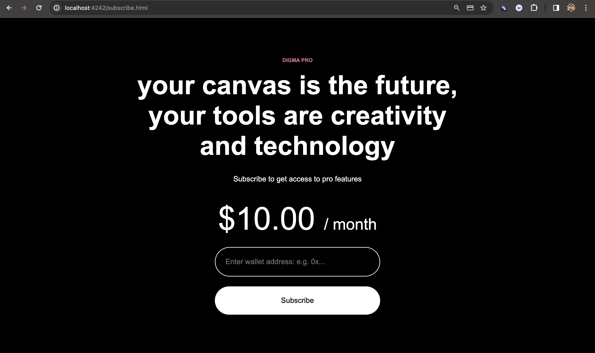
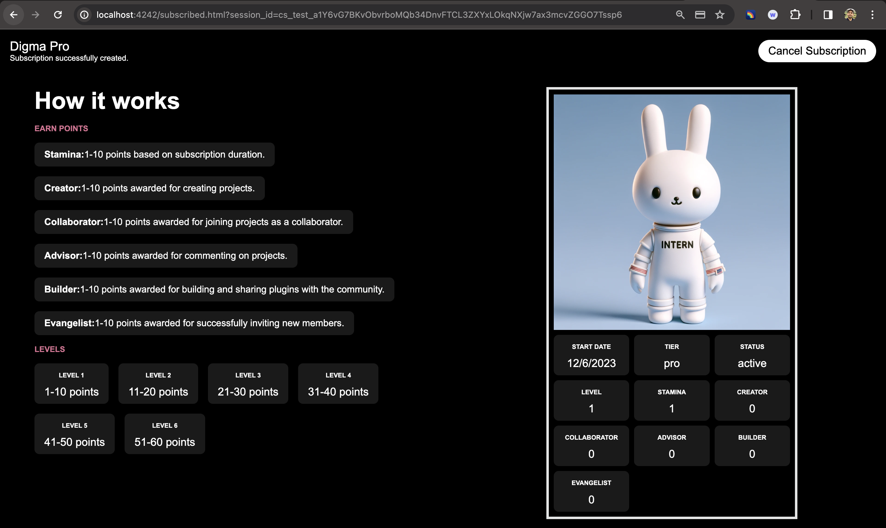

# Syndicate Stripe Subscriber NFT

This integration illustrates a process that a SaaS platform might implement. The integration enables the minting and distribution of NFTs as rewards to customers who subscribe via a Stripe integration. This application demonstrates the simplicity and efficiency of adding on-chain experiences to applications with syndicate tooling. 

Syndicate is building the infrastructure to power the next wave of web3 platforms and products at scale. Developers can leverage Syndicate’s infrastructure to abstract web3’s complexity, so your team can spend less time managing complex web3 infrastructure and more time building an exceptional end-to-end experience for your customers. Syndicate also provides a developer-friendly Transaction Cloud through our simple and robust REST APIs and developer documentation, enabling any developer to create powerful web3 products with ease and efficiency. Our Transaction Cloud is built with high throughput, real-time observability, security and permissioning in mind. Learn more about Syndicate’s Transaction Cloud. [Learn more](https://docs.syndicate.io/get-started/introduction).

| Features | Demonstrated |
| --- | --- |
| REST api abstraction | ✅ |
| Transaction broadcasting | ✅ |
| real-time monitoring dashboard | ✅ |
| Managed wallets and private keys for developer wallets  | ✅ |
| dynamic NFT metadata | ✅ |
| Managed gas | ✅ |
| syndicate webhooks |  |
| signing and attestations |  |
| ???? |  |

### demo

<div style="display: flex; justify-content: space-between;">
  
  
</div>
<br/><br/>

1. Product subscription page with price, add wallet field, and create subscription button
2. Stripe hosted checkout session with email, card details, name
3. Subscribed page with NFT metadata loaded once minting has completed.
    1. cancel button updates NFT metadata.
    2. invoice.paid event updates metadata to reward a stamina point

## How to run locally

### Setup syndicate and stripe

1. change .env.example to .env
2. Create a free tier organization via our **[dashboard](https://dashboard.syndicate.io/signup)**.
3. Using the dashboard create a demo project. Get your API Key and project Id from the setting tab and add to .env. `SYNDICATE_API_KEY=` and `SYNDICATE_PROJECT_ID=`.
4. Projects are provisioned with one wallet on creation. Go to Settings (⚙️) > Wallets and copy the wallet address. Use a **[faucet](https://mumbaifaucet.com/)** to fund your wallet with testnet MATIC.
5. You will need a Stripe account in order to run the demo. Once you set up your account, go to the Stripe [developer dashboard](https://stripe.com/docs/development#api-keys) to find your API keys. Add stripe API key to .env `STRIPE_API_KEY=`from dashboard
6. create product and pricing model via the dashboard and add a lookup_key to public/subscribe.html - `<input type="hidden" name="lookup_key" value="enter_lookup_key" />`
7. Setup Stripe CLI and add stripe webhook secret `STRIPE_WEBHOOK_SECRET=` from webhook tab (add local listener)


### Install dependencies 

```
npm install
brew install redis` (MacOS)
```

### Run 

```
stripe listen --forward-to localhost:4242/webhook
redis-server
npm run start-worker
npm run dev
```